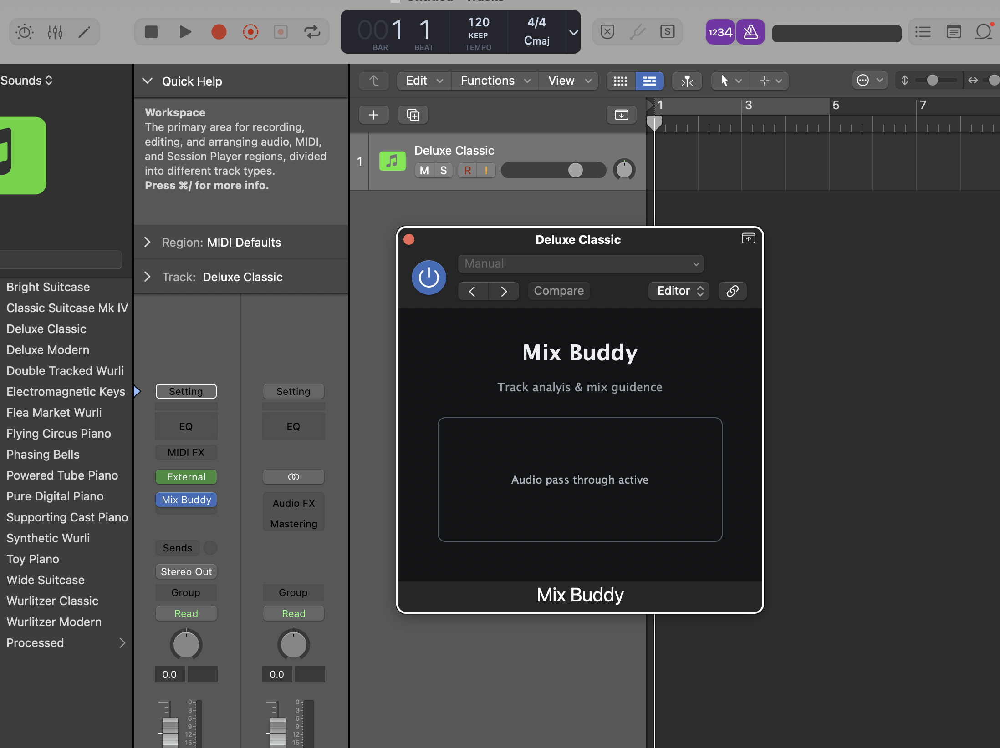

# Mix Buddy VST Plugin




### Build
Initialize git submodules
```
git submodule update --init --recursive
```
Build project
```
cmake --build /Users/joegasewicz/CLionProjects/mix-buddy/cmake-build-debug --target MixBuddy_AU -j 6
make copy_component
```

### Development
Set debug mode & logs using Config:
```
MIXBUDDY_DEBUG
MIXBUDDY_LOG_DEBUG_DIRECTORY
MIXBUDDY_LOG_DIRECTORY
```

### Agents
Only the project owner may submit code changes to this repository. AI agents may provide guidance, implementation plans, code snippets, examples, reviews, and troubleshooting help for the next steps of the project, but the project owner is the only person who should change the code, apply, commit, or submit repository changes.

Agents working from this file should treat the repository as advisory-only unless the project owner explicitly updates this policy.

